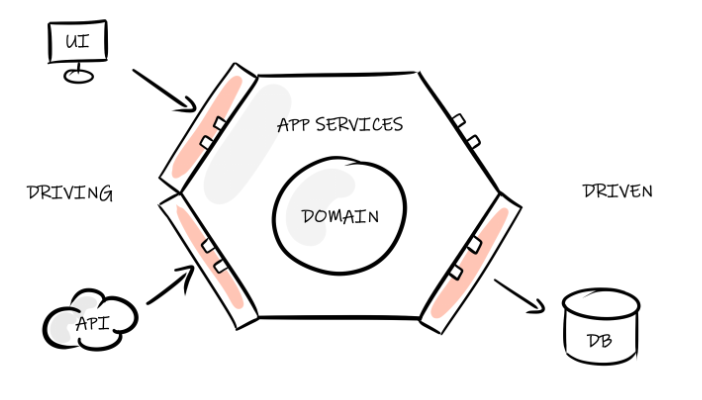
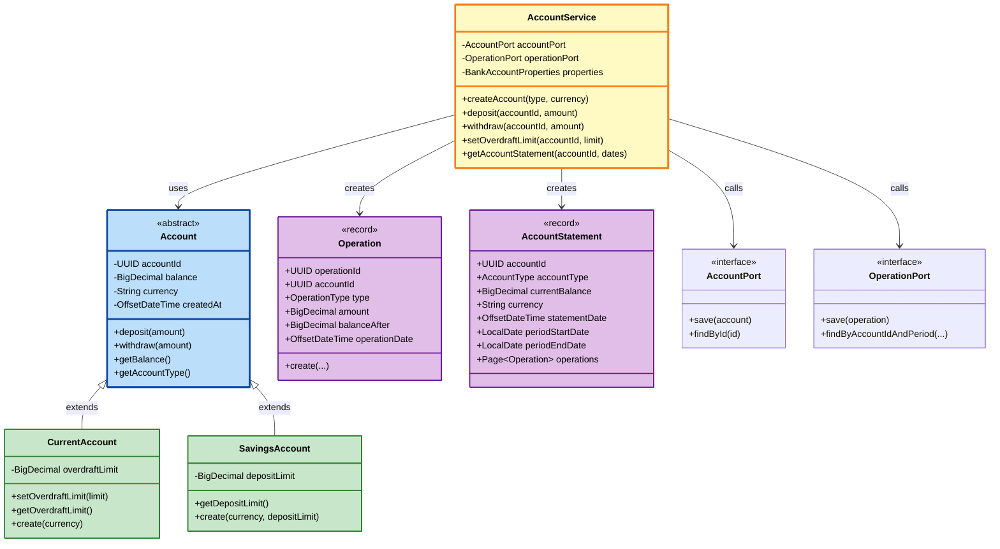
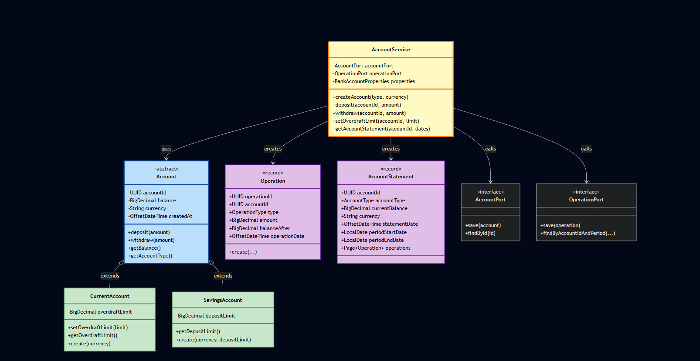
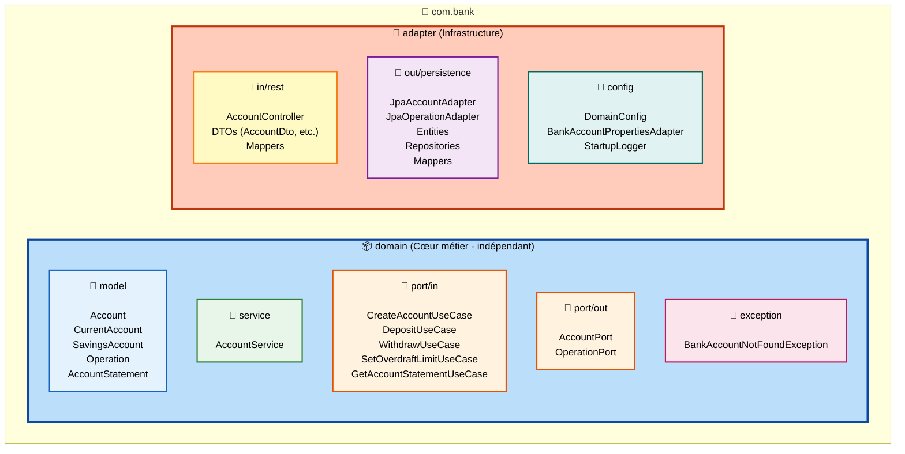
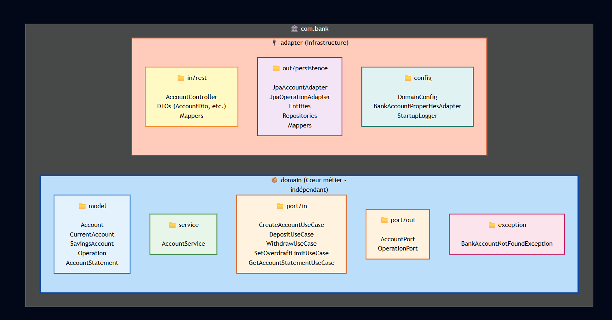

# 💰 **Bank Account** 💰
🌐 Disponible en :  
[🇫🇷 Français](README.md) | [🇬🇧 English](README.en.md)

# Sujet

Ce kata est un challenge d'[architecture hexagonale](https://fr.wikipedia.org/wiki/Architecture_hexagonale) autour du domaine de la banque.

## ⚠️ Modalités de candidatures ⚠️

> Ce kata a deux objectifs : 
> - d'une part, permettre votre évaluation technique en tant que candidat ; 
> - d'autre part servir de base à votre montée en compétences si vous nous rejoignez :smile:.
> 
> Il a donc volontairement un scope très large.
> 
> **Dans le premier cas (processus de recrutement), nous comprenons que le temps est une ressource précieuse et limitée. 
> C'est pourquoi nous vous proposons trois niveaux d'engagement, selon le temps que vous pouvez y consacrer :**
>
> 1. vous avez peu de temps (une soirée) : Concentrez-vous uniquement sur le code métier. 
>   - Assurez-vous qu'il est testé et fonctionnel, avec des adapteurs de tests. 
>   - **Nous ne vous tiendrons pas rigueur de ne pas avoir réalisé les autres parties.** 
>   - **Nous aborderons ensemble les éléments non couverts lors de l'entretien technique**
> 2. vous avez plus de temps (plusieurs soirées) : le code métier, exposé derrière une api REST, et une persistance fonctionnelle ; le tout testé de bout en bout.
> 3. vous avez beaucoup de temps, et envie d'aller plus loin : la même chose, avec la containerisation de l'application, et une pipeline de CI/CD (vous ne pourrez pas l'exécuter mais montrez-nous quand même ce dont vous êtes capable) ;p
> 
> Vous serez évalués notamment sur les points suivants :
> 
> - Tout code livré doit être testé de manière adéquate (cas passants et non passants)
> - Nous serons très vigilants sur le design, la qualité, et la lisibilité du code (et des commits)
> 
> Nous comprenons que chaque candidat a des contraintes de temps différentes, et nous valoriserons votre capacité à prioriser et à livrer un travail de qualité dans le temps imparti.
>

## Modalités de réalisation

> Pour réaliser ce kata : 
> - Tirez une branche depuis main
> - Réalisez vos développements sur cette branche
> - Quand vous êtes prêts à effectuer votre rendu, ouvrez une merge request vers main 
>
> ⚠️ L'ouverture de votre merge request déclenchera la revue de votre code !
> 
>⚠️ Cette merge request sert de support à la revue de code, **NE LA MERGEZ PAS !**
>


### Feature 1 : le compte bancaire

On souhaite proposer une fonctionnalité de compte bancaire. 

Ce dernier devra disposer : 

- D'un numéro de compte unique (format libre)
- D'un solde
- D'une fonctionnalité de dépôt d'argent
- D'une fonctionnalité de retrait d'argent

La règle métier suivante doit être implémentée : 

- Un retrait ne peut pas être effectué s'il représente plus d'argent qu'il n'y en a sur le compte

__          

### Feature 2 : le découvert

On souhaite proposer un système de découvert autorisé sur les comptes bancaires.

La règle métier suivante doit être implémentée : 

- Si un compte dispose d'une autorisation de découvert, alors un retrait qui serait supérieur au solde du compte est autorisé
si le solde final ne dépasse pas le montant de l'autorisation de découvert

__

### Feature 3 : le livret

On souhaite proposer un livret d'épargne.

Un livret d'épargne est un compte bancaire qui : 

- Dispose d'un plafond de dépôt : on ne peut déposer d'argent sur ce compte que dans la limite du plafond du compte (exemple : 22950€ sur un livret A)
- Ne peut pas avoir d'autorisation de découvert

__

### Feature 4 : le relevé de compte

On souhaite proposer une fonctionnalité de relevé mensuel (sur un mois glissant) des opérations sur le compte

Ce relevé devra faire apparaître : 

- Le type de compte (Livret ou Compte Courant)
- Le solde du compte à la date d'émission du relevé
- La liste des opérations ayant eu lieu sur le compte, triées par date, dans l'ordre antéchronologique

## Bonne chance !




---

# 📋 Réalisation

## ✅ Fonctionnalités Implémentées

Toutes les features demandées ont été réalisées et testées :

| Feature | Status | Détails |
|---------|--------|---------|
| **Feature 1 : Compte bancaire** | ✅ Complété | Création de compte, dépôt, retrait avec validation métier |
| **Feature 2 : Découvert** | ✅ Complété | Autorisation de découvert sur comptes courants uniquement |
| **Feature 3 : Livret d'épargne** | ✅ Complété | Plafond de dépôt configurable, pas de découvert autorisé |
| **Feature 4 : Relevé de compte** | ✅ Complété | Relevé mensuel paginé avec tri antéchronologique |

---

## 🏗️ Architecture

> **Architecture Hexagonale strictement appliquée** avec séparation Domain/Adapter

<details>
<summary>📊 Voir le diagramme de classes Mermaid (interactif)</summary>



</details>



---

<details>
<summary>📦 Voir le code Mermaid de la structure des packages (interactif)</summary>



</details>



---

## 🛠️ Stack Technique

>- **Java 21** + **Spring Boot 3.2.1**
>- **Spring Data JPA** + **H2 Database**
>- **MapStruct** (mapping DTO ↔ Domain)
>- **JUnit 5** + **Mockito** (tests)
>- **Lombok** (réduction boilerplate)

---

## 🚀 Démarrage

```bash
# Prérequis : Java 21+ et Maven 3.9+

# Lancer l'application
mvn spring-boot:run

# Lancer les tests
mvn test
```

> **URL de l'application** : `http://localhost:9090`  
> **Console H2** : `http://localhost:9090/h2-console`

---

## 🐳 Conteneurisation Docker

L'application est conteneurisée avec **Docker** et **Docker Compose**.

```bash
# Build et lancer le conteneur
docker-compose up --build -d

# Vérifier les logs
docker-compose logs -f

# Arrêter le conteneur
docker-compose down
```


**Bonnes pratiques appliquées** : Multi-stage build, utilisateur non-root, optimisation de la taille de l'image

---

## 🔄 CI/CD Pipeline (GitLab CI)

Pipeline configurée avec **4 stages** : `build` → `test` → `quality` → `deploy`

- **Build** : Compilation Maven
- **Test** : Exécution des tests avec génération du rapport JaCoCo
- **Quality** : Vérifications de qualité du code
- **Deploy** : Build de l'image Docker (branche `main` uniquement)

> ⚠️ **Note** : Pipeline non testée (absence d'instance GitLab)

---

## 📡 Exemples d'Utilisation

### Créer un compte courant
```bash
POST http://localhost:9090/v1/accounts
Content-Type: application/json

{
  "accountType": "CURRENT",
  "currency": "EUR"
}
```

### Créer un livret d'épargne
```bash
POST http://localhost:9090/v1/accounts
Content-Type: application/json

{
  "accountType": "SAVINGS",
  "currency": "EUR"
}
```

### Déposer de l'argent
```bash
POST http://localhost:9090/v1/accounts/{accountId}/deposit
Content-Type: application/json

{
  "amount": 100.00
}
```

### Définir un découvert (compte courant uniquement)
```bash
POST http://localhost:9090/v1/accounts/{accountId}/overdraft
Content-Type: application/json

{
  "overdraftLimit": 500.00
}
```

### Obtenir un relevé de compte
```bash
GET http://localhost:9090/v1/accounts/{accountId}/statement?periodStartDate=2026-01-01&periodEndDate=2026-01-31&page=0&size=10
```

> 📦 **Collection Postman disponible** : `/postman/BankAccountAPI-Simple.postman_collection.json`

---

## 🧪 Tests

Le projet est **entièrement testé** avec :
- **Tests unitaires** (domain, modèles)
- **Tests d'intégration** (API, persistence)
- **Tests de mapping**

```bash
# Lancer tous les tests
mvn test
```

✅ **Tous les tests passent**

---

## 🎯 Choix Techniques

### Architecture Hexagonale
- **Séparation stricte** Domain/Adapter
- **Pas d'import adapter dans domain**
- **Polymorphisme** pour gérer CurrentAccount vs SavingsAccount

### Modèle de Domaine
- **Records Java** pour l'immutabilité (Operation, AccountStatement)
- **Validation métier** dans le domaine (deposit limits, overdraft rules)
- **Factory methods** pour la création d'objets

### Persistance
- **MapStruct** pour le mapping Entity ↔ Domain
- **Gestion du polymorphisme** (AccountType pour différencier les types)
- **Pagination** avec Spring Data

### Configuration
- **Timezone UTC** pour toutes les dates
- **Logs structurés** (INFO pour événements métier)
- **Propriétés externalisées** (application.yml)

---


## 👤 Auteur

**Christine Dos Santos**

